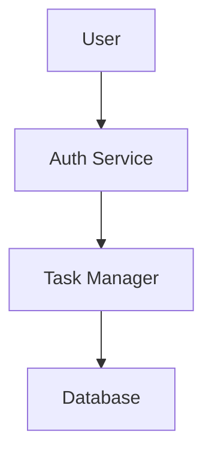

# Phase-5: Specs Management System ✅ COMPLETE

## Overview
Phase-5 adds a complete specifications management system with Markdown/YAML editing, live Mermaid diagram preview, PDF export, and automated task scaffolding with Jest test generation. Features a professional resizable split-view interface.

## What Was Implemented

### 📝 Specs Panel
- **Resizable Split View**: Drag the center divider to adjust editor/preview width
- **Monaco Editor**: Full-featured code editor for Markdown/YAML
- **Live Mermaid Preview**: Real-time diagram rendering with dark theme
- **File Management**: Create, save, and load specs from `.kiro/specs/`
- **Export Options**: Export to Markdown and PDF formats with proper styling
- **Task Approval**: Parse JSON task blocks and generate Jest test scaffolding

### 🗂️ File System Integration
- **Workspace-Safe**: All operations confined to opened workspace
- **Directory Structure**: Automatic `.kiro/specs/` and `.kiro/` creation
- **Multiple Formats**: Support for `.md`, `.yaml`, and `.yml` files
- **Task Persistence**: Tasks saved to `.kiro/tasks.json`

### 🧪 Test Scaffolding
- **Jest Integration**: Auto-generate test stubs from approved tasks
- **File Organization**: Tests created in `tests/tasks/` directory
- **Task Mapping**: Each task becomes a describe block with TODO implementation

### 🎨 UI Enhancements
- **Tabbed Interface**: Chat and Specs tabs in right panel
- **Responsive Layout**: Split editor/preview with proper sizing
- **Export Controls**: Dedicated buttons for MD/PDF export
- **Approval Workflow**: One-click task approval and scaffolding

## New Dependencies

### Renderer
```bash
pnpm add -F @kiroclone/app-renderer markdown-it mermaid
pnpm add -D -F @kiroclone/app-renderer @types/markdown-it
```

## File Structure

```
packages/
├── app-renderer/src/ui/
│   ├── SpecsPanel.tsx        # Main specs editor/preview
│   └── RightTabs.tsx         # Chat/Specs tab container
├── app-electron/src/
│   ├── main.ts               # Added Phase-5 IPC handlers
│   └── preload.ts            # Exposed specs API methods
└── workspace/
    └── .kiro/
        ├── specs/            # Spec files (.md, .yaml, .yml)
        ├── tasks.json        # Approved tasks
        └── tests/tasks/      # Generated Jest test stubs
```

## New IPC Methods

### Specs Management
- `kiroEnsure()` - Ensure `.kiro/specs/` directories exist
- `specsList()` - List all spec files (names without extensions)
- `specRead(name)` - Read spec file content
- `specWrite(name, ext, content)` - Save spec file
- `specExportMarkdown(name, content)` - Export to MD file
- `specExportPDF(name, html)` - Export to PDF using Electron's printToPDF

### Task Management
- `tasksWrite(json)` - Save tasks to `.kiro/tasks.json`
- `jestScaffoldForTasks(tasks)` - Generate Jest test stubs

## Usage Guide

### 1. Creating Specs

1. **Open Workspace**: Use "Open Folder" to select a project directory
2. **Switch to Specs Tab**: Click "Specs" in the right panel
3. **Create New Spec**: 
   - Enter filename in the input field
   - Choose format: Markdown (.md) or YAML (.yaml/.yml)
   - Start editing in the Monaco editor

### 2. Spec Format

**Example Markdown Spec:**
```markdown
# Todo App Specification

## Requirements
- User authentication
- Task CRUD operations
- Due date management

## System Design



## Tasks

```json tasks
[
  {
    "id": "T1",
    "title": "Setup authentication",
    "description": "Implement user login/logout"
  },
  {
    "id": "T2", 
    "title": "Create task CRUD",
    "description": "Add, edit, delete, list tasks"
  }
]
```
```

### 3. Live Preview Features

- **Markdown Rendering**: Real-time HTML preview with styling
- **Mermaid Diagrams**: Automatic diagram rendering from code blocks
- **Syntax Highlighting**: Code blocks with proper highlighting
- **Responsive Layout**: Side-by-side editor and preview

### 4. Export Options

**Export to Markdown:**
- Click "Export MD" button
- Choose save location
- Creates standalone `.md` file

**Export to PDF:**
- Click "Export PDF" button
- Choose save location  
- Generates PDF with embedded diagrams and styling

### 5. Task Approval Workflow

1. **Add Tasks Block**: Include `json tasks` code fence in spec
2. **Define Tasks**: JSON array with `id`, `title`, `description`
3. **Click Approve**: Processes tasks and generates scaffolding
4. **Results**:
   - Tasks saved to `.kiro/tasks.json`
   - Jest test stubs created in `tests/tasks/`
   - Success notification with count

**Generated Test Example:**
```typescript
// Auto-generated by KiroClone (Phase 5)
describe("Setup authentication", () => {
  it('should be implemented', () => {
    // TODO: implement for task: T1
    expect(true).toBe(true);
  });
});
```

## Running Phase-5

### Terminal Setup (same as Phase-4)

**Terminal 1 - Server:**
```bash
cd "C:\Users\YourName\KiroClone"
pnpm --filter @kiroclone/server dev
```

**Terminal 2 - Renderer:**
```bash
cd "C:\Users\YourName\KiroClone"
pnpm --filter @kiroclone/app-renderer dev
```

**Terminal 3 - Electron:**
```bash
cd "C:\Users\YourName\KiroClone\packages\app-electron"
../../node_modules/.bin/tsc ; ../../node_modules/.bin/electron .
```

### Testing Checklist

1. **✅ Open Workspace**: Select any folder
2. **✅ Specs Tab**: Switch to Specs in right panel  
3. **✅ Create Spec**: Enter name, choose format, start editing
4. **✅ Live Preview**: See Markdown rendering in real-time
5. **✅ Mermaid Diagrams**: Add mermaid code block, see diagram render
6. **✅ Resizable Layout**: Drag center divider to adjust editor/preview width
7. **✅ Save Spec**: Click Save, verify file created in `.kiro/specs/`
8. **✅ Export MD**: Export to Markdown file with proper formatting
9. **✅ Export PDF**: Export to PDF with embedded diagrams
10. **✅ Task Approval**: Add tasks JSON block, click Approve
11. **✅ Verify Output**: Check `.kiro/tasks.json` and `tests/tasks/` directory

## Security Features

- **Workspace Isolation**: All file operations restricted to opened workspace
- **Path Validation**: `isInside()` checks prevent directory traversal
- **Sandboxed PDF**: PDF generation uses isolated Electron window
- **Local Processing**: All Markdown/Mermaid rendering happens locally

## Integration with Phase-4

- **Chat Tab**: Existing Claude Sonnet 4 chat functionality preserved
- **Spec Generation**: Use "Gen Spec" in Chat to create initial spec content
- **Copy/Paste Workflow**: Generate spec with AI, copy to Specs panel for editing
- **Task Extraction**: AI-generated specs can include task JSON blocks

## Troubleshooting

### Specs Panel Not Loading
- Verify workspace is opened (Open Folder first)
- Check browser console for JavaScript errors
- Restart Electron if IPC methods not available

### Mermaid Diagrams Not Rendering
- Check mermaid syntax in code blocks
- Verify `mermaid` package installed correctly
- Look for error messages in preview panel

### PDF Export Issues
- Ensure sufficient disk space for PDF generation
- Check file permissions in target directory
- Verify Electron has access to create temporary windows

### Jest Scaffolding Errors
- Confirm tasks JSON format is valid
- Check workspace write permissions
- Verify `tests/tasks/` directory creation

## 🎯 Key UI Features

### **Resizable Split View**
- **Interactive Divider**: Click and drag the center divider to adjust layout
- **Visual Handle**: Gray divider with centered handle for easy identification  
- **Smooth Resizing**: Real-time width adjustment with mouse tracking
- **Smart Constraints**: 20%-80% range prevents unusable layouts
- **Responsive**: Maintains proportions when window is resized

### **Professional Interface**
- **Compact Toolbar**: Fixed header with file controls and action buttons
- **Color-Coded Actions**: Blue Save, Purple Export MD, Red Export PDF, Green Approve
- **Monaco Integration**: Full VS Code editor experience with syntax highlighting
- **Clean Layout**: No infinite scrollbars, proper overflow handling
- **IDE-Style**: Matches modern development environment standards

## What's Next

Phase-5 completes the core KiroClone functionality with:
- ✅ AI-powered chat and spec generation (Claude Sonnet 4)
- ✅ Complete specs management workflow with resizable interface
- ✅ Local-first file operations (.kiro/specs/, .kiro/tasks.json)
- ✅ Export capabilities (Markdown/PDF with embedded diagrams)
- ✅ Automated Jest test scaffolding from approved tasks
- ✅ Professional resizable split-view editor

**Future Enhancements:**
- Spec templates and snippets library
- Advanced Mermaid diagram types (sequence, class, etc.)
- Task dependency visualization and Gantt charts
- Integration with external task trackers (Jira, GitHub Issues)
- Real-time collaborative editing features
- Spec versioning and diff visualization

## Git Repository
All Phase-5 changes committed to: `https://github.com/manju-rog/ai_electron.git`